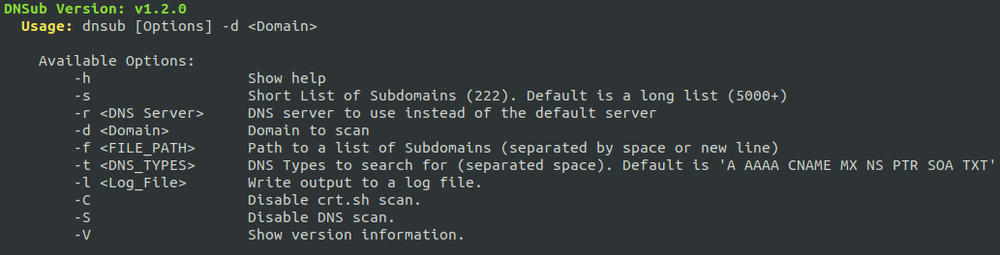

# DNSub v1.2.0

Subdomain discovery tool



### Install (Linux)

Simply clone the repository to the location you want:
(Example: you want to place it in `~/apps/`
```Bash
mkdir -p ~/apps/
cd ~/apps/
git clone https://github.com/AyoobAli/DNSub
cd DNSub
chmod +x dnsub
./dnsub
```

*To run the application from any directory, just create a symlink of `dnsub` in your bin directory.*

```Bash
ln -s ~/apps/DNSub/dnsub ~/bin/dnsub
```


OR One line installation:

```bash
mkdir -p ~/bin/ && mkdir -p ~/apps/ && cd ~/apps/ && git clone https://github.com/ayoobali/DNSub && cd DNSub && chmod u+x dnsub && ln -s ~/apps/DNSub/dnsub ~/bin/dnsub
```

### Usage

To scan a domain:

```bash
dnsub -d <Domain>
```

To scan multiple domains:

```bash
cat <Path_to_Domains_List> | while IFS= read -r domainName || [ -n "$domainName" ]; do dnsub -d "$domainName" -f <Path_to_List>; done
```
